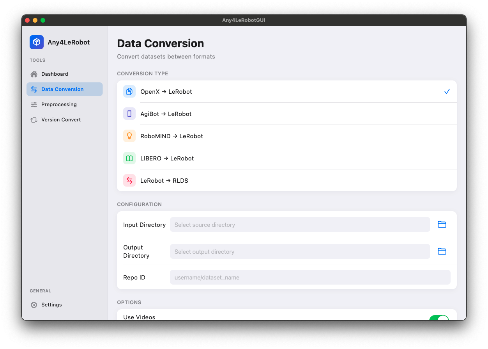
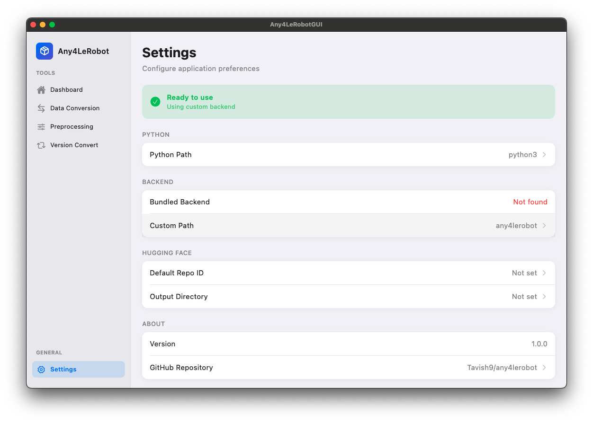

# Any4LeRobot GUI

A beautiful, Apple-style desktop application for managing LeRobot datasets on macOS.


## Features

- **Data Conversion** - Convert datasets from OpenX, AgiBot-World, RoboMIND, LIBERO to LeRobot format
- **Dataset Merging** - Combine multiple LeRobot datasets with configurable parameters
- **Version Conversion** - Upgrade/downgrade between LeRobot versions (v1.6 ↔ v2.0 ↔ v2.1 ↔ v3.0)
- **Job Management** - Real-time job monitoring with logs and cancel support

## Screenshots

### Data Conversion
Select from multiple conversion types (OpenX, AgiBot, RoboMIND, LIBERO → LeRobot) with configurable options.



### Settings
Configure Python path, backend location, and Hugging Face integration with grouped macOS-style settings lists.



**Design Highlights:**
- 🍎 Native macOS sidebar navigation
- 📋 Grouped settings lists (iOS-style)
- 🎨 Apple system colors and SF Pro fonts
- ✨ Subtle shadows and Cupertino controls

## Requirements

- **macOS** (Apple Silicon recommended)
- **Flutter** 3.38+
- **Python** 3.10+ with virtual environment

## Quick Start

### 1. Clone & Setup

```bash
# Clone with submodules
git clone --recursive <repo-url>
cd drifting-zodiac

# Or if already cloned, initialize submodule:
git submodule update --init --recursive

# Setup Python virtual environment
python3 -m venv backend/.venv
source backend/.venv/bin/activate
pip install numpy lerobot huggingface_hub tqdm pillow torch
```

### 2. Sync Backend with Upstream

```bash
# Update backend to latest from any4lerobot repo
git submodule update --remote backend
git add backend
git commit -m "Update backend to latest"
```

### 2. Run the App

```bash
# Ensure CocoaPods works (may need: PATH=/opt/homebrew/opt/ruby/bin:$PATH)
flutter run -d macos
```

## Project Structure

```
.
├── lib/
│   ├── main.dart                    # App entry, theme, navigation
│   ├── services/
│   │   ├── settings_service.dart    # Persistent settings & backend detection
│   │   └── process_manager.dart     # Python subprocess execution
│   └── screens/
│       ├── home_screen.dart         # Dashboard with job list
│       ├── data_conversion/         # OpenX, AgiBot, etc. conversion
│       ├── preprocessing/           # Merge, filter, sample datasets
│       ├── version_convert/         # LeRobot version conversion
│       └── settings/                # App configuration
├── backend/                         # any4lerobot Python scripts
│   ├── openx2lerobot/
│   ├── agibot2lerobot/
│   ├── robomind2lerobot/
│   ├── libero2lerobot/
│   ├── lerobot2rlds/
│   ├── dataset_merging/
│   └── ds_version_convert/
└── macos/                           # macOS platform files
```

## Configuration

On first launch:
1. The app auto-detects the bundled `backend/` directory
2. Settings can be customized in the **Settings** screen
3. Python venv path is automatically used: `backend/.venv/bin/python`

## Usage

### Data Conversion
1. Select conversion type (e.g., OpenX → LeRobot)
2. Choose input/output directories
3. Configure options (videos, push to hub)
4. Click **Start Conversion**

### Dataset Merging
1. Go to **Preprocessing** → **Merge**
2. Add multiple source datasets
3. Set parameters (state/action dims, FPS)
4. Click **Start Merge**

### Version Conversion
1. Select version path (e.g., v2.1 → v3.0)
2. Choose dataset directory
3. Click **Start Conversion**

## Dependencies

### Flutter Packages
- `provider` - State management
- `file_picker` - Directory selection
- `shared_preferences` - Persistent settings
- `flutter_animate` - UI animations

### Python Packages
- `lerobot` - Dataset format
- `numpy`, `torch` - Computation
- `huggingface_hub` - Hub integration
- `tensorflow` (optional) - For OpenX conversion

## Troubleshooting

### CocoaPods Issues
```bash
# If CocoaPods is broken due to Ruby version conflicts:
PATH=/opt/homebrew/opt/ruby/bin:$PATH pod install
PATH=/opt/homebrew/opt/ruby/bin:$PATH flutter run -d macos
```

### Missing Python Modules
```bash
# Activate venv and install missing packages:
source backend/.venv/bin/activate
pip install <missing-package>
```

## License

MIT License - See LICENSE file for details.

## Credits

- Backend: [any4lerobot](https://github.com/Tavish9/any4lerobot) by Tavish9
- UI Framework: Flutter with Cupertino design
